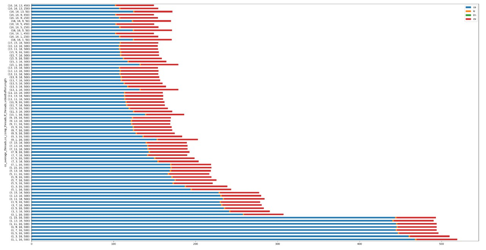

# Video Summary and Classification

## Example:
  
What you see above is a 15 second excerpt of a 2 minute overlayed synopsis of a 2.5h video from an on campus web cam.  
The synopsis took 40 minutes from start to finish on a 8 core machine and used a maximum of 6Gb of RAM.

However since the contour extraction could be performed on a video stream, the benchmark results show that a single core would be enough to process a video faster than real time.

## Benchmark
Below you can find the benchmark results for a 10 minutes clip, with the stacked time per component on the x-axis.  
The tests were done on a machine with a Ryzen 3700X with 8 cores 16 threads and 32 Gb of RAM.  
On my configuration 1 minutes of of the original Video can be processed in about 20 seconds, the expected processing time is about 1/3 of the orignial video length. 

- CE = Contour Extractor  
- LE = LayerFactory  
- LM = LayerManager  
- EX = Exporter  

  

#### notes:

install tensorflow==1.15.0 and tensorflow-gpu==1.15.0, cuda 10.2 and 10.0, copy missing files from 10.0 to 10.2, restart computer, set maximum vram
