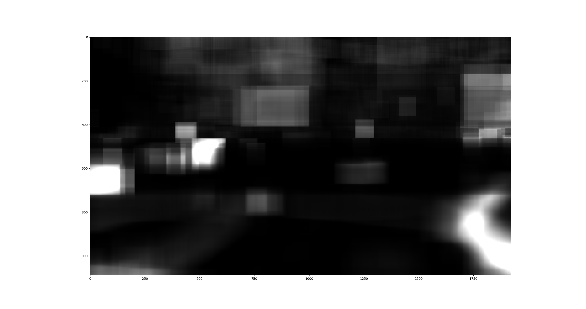

# Video-Summary

[](https://github.com/Askill/Video-Summary/actions)
[](https://www.python.org/downloads/)
[](https://opensource.org/licenses/MIT)

A Python-based video summarization tool that extracts contours from video frames to create condensed summaries. Perfect for analyzing surveillance footage, time-lapse videos, or any static camera recording where you want to extract and visualize movement over time.

## ✨ Features

- **Movement Detection**: Automatically detects and extracts moving objects from static camera footage
- **Layer-Based Processing**: Groups related movements across frames into coherent layers
- **Heatmap Generation**: Visualizes areas of activity in the video
- **Configurable**: Extensive configuration options for fine-tuning detection sensitivity
- **Efficient**: Processes video faster than real-time on modern hardware
- **Caching**: Saves intermediate results for faster re-processing with different parameters

## 🚀 Quick Start

### Installation

```bash
# Clone the repository
git clone https://github.com/Askill/Video-Summary.git
cd Video-Summary

# Create virtual environment
python -m venv venv
source venv/bin/activate  # On Windows: venv\Scripts\activate

# Install dependencies
pip install -r requirements.txt

# Install system dependencies (Linux)
sudo apt-get install ffmpeg libsm6 libxext6 libxrender-dev
```

### Basic Usage

```bash
# Process a video with default settings
python main.py input_video.mp4 output_dir

# Use custom configuration
python main.py input_video.mp4 output_dir config.json

# Enable verbose logging
python main.py input_video.mp4 output_dir --verbose
```

## 📊 Example Output


*A 15-second excerpt of a 2-minute overlaid synopsis of a 2.5-hour video from a campus webcam.*

### Heatmap Visualization



The heatmap shows areas of activity throughout the video, with brighter regions indicating more movement.

## ⚙️ Configuration

Create a JSON configuration file to customize processing parameters:

```json
{
  "min_area": 300,
  "max_area": 900000,
  "threshold": 7,
  "resizeWidth": 700,
  "maxLayerLength": 5000,
  "minLayerLength": 40,
  "tolerance": 20,
  "ttolerance": 50,
  "videoBufferLength": 250,
  "LayersPerContour": 220,
  "avgNum": 10
}
```

### Configuration Parameters

| Parameter | Description | Default |
|-----------|-------------|---------|
| `min_area` | Minimum contour area in pixels (smaller ignored) | 300 |
| `max_area` | Maximum contour area in pixels (larger ignored) | 900000 |
| `threshold` | Luminance difference threshold for movement detection | 7 |
| `resizeWidth` | Video is scaled to this width internally for processing | 700 |
| `maxLayerLength` | Maximum length of a layer in frames | 5000 |
| `minLayerLength` | Minimum length of a layer in frames | 40 |
| `tolerance` | Max distance (pixels) between contours to aggregate into layer | 20 |
| `ttolerance` | Number of frames movement can be apart before creating new layer | 50 |
| `videoBufferLength` | Buffer length of Video Reader component | 250 |
| `LayersPerContour` | Number of layers a single contour can belong to | 220 |
| `avgNum` | Number of images to average before calculating difference | 10 |

> **Note**: `avgNum` is computationally expensive but needed in outdoor scenarios with clouds, leaves moving in wind, etc.

## 📈 Performance Benchmarks

**Test Configuration:**
- Hardware: Ryzen 3700X (8 cores, 16 threads), 32GB RAM
- Video: 10-minute clip
- Processing Speed: ~20 seconds per minute of video (1:3 ratio)
- Memory Usage: Max 6GB RAM

**Component Breakdown:**
- CE = Contour Extractor
- LF = Layer Factory
- LM = Layer Manager
- EX = Exporter


## 🏗️ Architecture

```
Video-Summary/
├── Application/              # Core processing modules
│   ├── Config.py            # Configuration management
│   ├── ContourExctractor.py # Movement detection
│   ├── LayerFactory.py      # Layer extraction
│   ├── LayerManager.py      # Layer optimization
│   ├── Exporter.py          # Output generation
│   ├── VideoReader.py       # Video I/O
│   ├── HeatMap.py           # Heatmap generation
│   ├── Importer.py          # Cache loading
│   ├── Layer.py             # Layer data structure
│   └── Logger.py            # Logging utilities
├── main.py                  # CLI entry point
├── pyproject.toml           # Package configuration
└── requirements.txt         # Dependencies
```

### Processing Pipeline

1. **Video Reading**: Load and preprocess video frames
2. **Contour Extraction**: Detect movement by comparing consecutive frames
3. **Layer Creation**: Group related contours across frames
4. **Layer Management**: Filter and optimize layers based on configuration
5. **Export**: Generate output video with overlaid movement and heatmap

## 🧪 Development

### Code Quality Tools

We use modern Python development tools:

- **Black**: Code formatting
- **isort**: Import sorting
- **flake8**: Linting
- **mypy**: Type checking
- **pre-commit**: Automated checks

```bash
# Install development dependencies
pip install -e ".[dev]"

# Install pre-commit hooks
pre-commit install

# Run formatting
black .
isort .

# Run linting
flake8 .
mypy Application/ main.py
```

### Running Tests

```bash
# Run all tests
pytest

# Run with coverage
pytest --cov=Application --cov-report=html
```

## 📝 Contributing

We welcome contributions! Please see [CONTRIBUTING.md](CONTRIBUTING.md) for guidelines.

## 📄 License

This project is licensed under the MIT License - see the [LICENSE](LICENSE) file for details.

The original Creative Commons licensed documentation can be found in [licens.txt](licens.txt).

## 🙏 Acknowledgments

- Built with OpenCV, NumPy, and imageio
- Inspired by video synopsis research in computer vision

## 📮 Contact

For questions or issues, please [open an issue](https://github.com/Askill/Video-Summary/issues) on GitHub.

---

**Note**: TensorFlow support is optional and not required for core functionality. The project works perfectly fine without GPU acceleration, though processing times will be longer for large videos.
